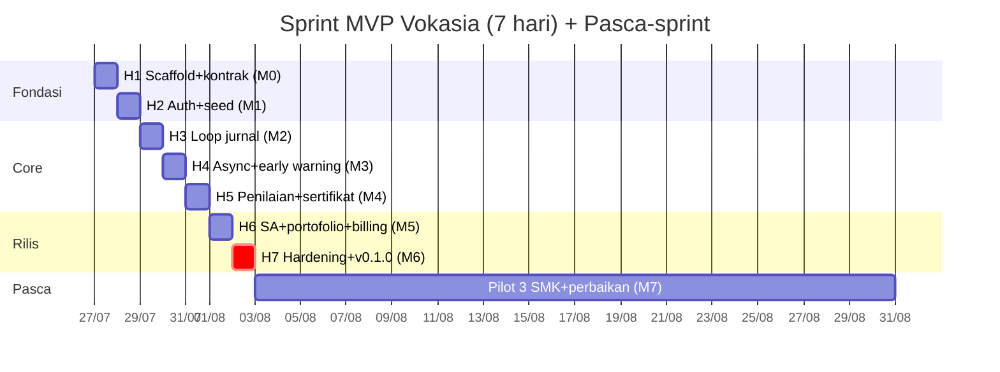
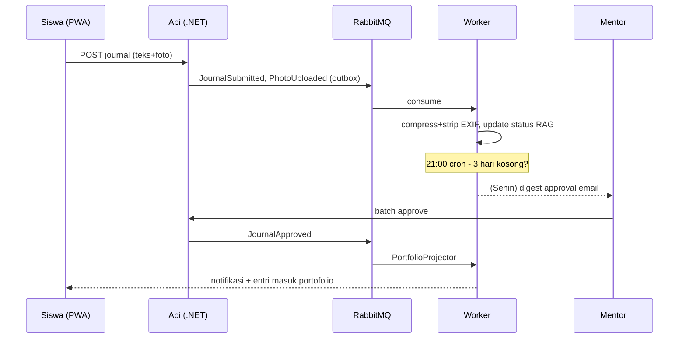

# VOKASIA — Dokumen Proyek Lengkap (Single File)

**Platform Manajemen PKL (Praktik Kerja Lapangan) SMK — Multi-tenant SaaS**

| Meta | Value |
|---|---|
| Kode | VOK-PRD v2.0 (konsolidasi: Charter + SRS + Plan + Desain + Risiko) |
| Tanggal | 20 Juli 2026 |
| Lokasi repo | `D:\Web\Vokasia` |
| Tim | 1 Solo Developer (orchestrator) + VPM (Claude: PM & Code Review) + ENG-1/2/3 (ChatGPT: engineering) |
| Stack | Backend **C# .NET 10 LTS** · Frontend **Next.js 16 (Bun)** · PostgreSQL · Redis · RabbitMQ · MinIO · Docker |

---

# BAGIAN 0 — STRUKTUR REPO & URUTAN SCAFFOLDING

## 0.1 Struktur akhir (2 project dalam 1 folder)

```
D:\Web\Vokasia
├── PRD.md                          ← dokumen ini
├── docker-compose.yml              ← 7 service (root)
├── .env.example
├── backend\                        ← PROJECT 1 (dotnet)
│   ├── Vokasia.sln
│   ├── src\Vokasia.Api\            ← REST API + OpenIddict OAuth server + Hangfire dashboard
│   ├── src\Vokasia.Worker\         ← Background jobs: MassTransit consumers + Hangfire server
│   ├── src\Vokasia.Domain\         ← Entities + domain logic (tanpa dependency infra)
│   ├── src\Vokasia.Infrastructure\ ← EF Core, MinIO, email, seeder (Bogus)
│   └── tests\Vokasia.Tests\        ← xUnit (unit + integration)
└── frontend\                       ← PROJECT 2 (bun + Next.js 16)
    └── src\app\
        ├── (sa)\        → /sa       Superadmin
        ├── (school)\    → /app      Admin sekolah + guru
        ├── (mentor)\    → /mentor   Mentor industri (DUDI)
        ├── (student)\   → /student  Siswa (PWA)
        ├── p\[slug]\    → publik    Portofolio siswa
        └── verify\[code]\           Verifikasi sertifikat
```

> Keputusan arsitektur: OAuth server (OpenIddict) **digabung ke Vokasia.Api** (bukan project terpisah) — menyederhanakan deploy solo dev tanpa mengubah desain auth (BFF + cookie + JWT tetap sama).

## 0.2 Urutan scaffolding (jalankan berurutan, PowerShell)

```powershell
# ── 0) Prasyarat ─────────────────────────────────────────────
# .NET 10 SDK · Bun ≥ 1.2 · Docker Desktop
cd D:\Web\Vokasia

# ── 1) BACKEND — template via dotnet ─────────────────────────
mkdir backend; cd backend
dotnet new sln -n Vokasia
dotnet new webapi   -o src/Vokasia.Api
dotnet new worker   -o src/Vokasia.Worker
dotnet new classlib -o src/Vokasia.Domain
dotnet new classlib -o src/Vokasia.Infrastructure
dotnet new xunit    -o tests/Vokasia.Tests
dotnet sln add src/Vokasia.Api src/Vokasia.Worker src/Vokasia.Domain src/Vokasia.Infrastructure tests/Vokasia.Tests

# Referensi antar-project
dotnet add src/Vokasia.Infrastructure reference src/Vokasia.Domain
dotnet add src/Vokasia.Api    reference src/Vokasia.Domain src/Vokasia.Infrastructure
dotnet add src/Vokasia.Worker reference src/Vokasia.Domain src/Vokasia.Infrastructure
dotnet add tests/Vokasia.Tests reference src/Vokasia.Api src/Vokasia.Worker

# Paket inti — Api
dotnet add src/Vokasia.Api package Npgsql.EntityFrameworkCore.PostgreSQL
dotnet add src/Vokasia.Api package Microsoft.EntityFrameworkCore.Design
dotnet add src/Vokasia.Api package OpenIddict.AspNetCore
dotnet add src/Vokasia.Api package OpenIddict.EntityFrameworkCore
dotnet add src/Vokasia.Api package Microsoft.AspNetCore.Identity.EntityFrameworkCore
dotnet add src/Vokasia.Api package MassTransit.RabbitMQ
dotnet add src/Vokasia.Api package Hangfire.AspNetCore
dotnet add src/Vokasia.Api package Hangfire.PostgreSql
dotnet add src/Vokasia.Api package FluentValidation.DependencyInjectionExtensions
dotnet add src/Vokasia.Api package StackExchange.Redis
dotnet add src/Vokasia.Api package Minio

# Paket inti — Worker & Infrastructure
dotnet add src/Vokasia.Worker package MassTransit.RabbitMQ
dotnet add src/Vokasia.Worker package Hangfire.PostgreSql
dotnet add src/Vokasia.Worker package QuestPDF
dotnet add src/Vokasia.Infrastructure package Bogus
dotnet add tests/Vokasia.Tests package Testcontainers.PostgreSql

dotnet build   # ✅ harus hijau sebelum lanjut

# ── 2) FRONTEND — template via bun ───────────────────────────
cd D:\Web\Vokasia
bun create next-app frontend --typescript --tailwind --app --src-dir --import-alias "@/*"
cd frontend
bun add zod @tanstack/react-query
bun dev        # ✅ cek http://localhost:3000 lalu hentikan

# ── 3) ROOT — compose & env ──────────────────────────────────
cd D:\Web\Vokasia
# buat docker-compose.yml (Bab 7 arsitektur: api, worker, frontend, postgres, redis, rabbitmq, minio)
# buat .env.example (connection strings, OpenIddict keys, SMTP)
docker compose up -d postgres redis rabbitmq minio   # infra dulu, app menyusul di Hari 1 sprint
```

---

# BAGIAN 1 — PROJECT CHARTER (Piagam Proyek)

## 1.1 Latar Belakang

PKL kini **mata pelajaran wajib** Kurikulum Merdeka (Kepmendikbudristek 262/M/2022): minimal **6 bulan / 792 JP di kelas XII**. ±14 ribu SMK wajib merencanakan, memonitor, menilai, dan mendokumentasikan PKL formal seperti mapel — tetapi praktik lapangan masih buku jurnal kertas + grup WhatsApp. Sementara itu **TPT lulusan SMK tertinggi nasional (7,74%, BPS Feb 2026; 813.776 penganggur)** — PKL 6 bulan tidak meninggalkan bukti kompetensi untuk melamar kerja. Kompetitor hanya sistem per-sekolah (single-tenant, kelas skripsi); **belum ada SaaS nasional** dengan jaringan DUDI lintas sekolah.

## 1.2 Tujuan (SMART)

| # | Tujuan | Ukuran | Waktu |
|---|---|---|---|
| T1 | MVP fungsional lengkap | Demo end-to-end 4 role, tag `v0.1.0` | Sprint 7 hari |
| T2 | Pilot | 3 SMK aktif (negeri besar, swasta kecil, luar Jawa) | +1 bulan |
| T3 | Validasi engagement | ≥75% jurnal harian terisi di pilot | Minggu ke-4 pilot |
| T4 | Monetisasi awal | 10 sekolah berbayar | +3 bulan |
| T5 | Skala | 150 sekolah ≈ Rp 44,8 jt MRR | +12 bulan |

## 1.3 Ruang Lingkup

**In-scope (MVP):** multi-tenant (sekolah=tenant, DUDI=global lintas tenant); 5 surface; siklus penuh periode→penempatan→jurnal harian+foto→approval mentor→monitoring guru→penilaian rubrik→sertifikat PDF ber-QR→portofolio publik opt-in; RBAC 8 role dua lapis; async backbone (Hangfire cron, RabbitMQ/MassTransit queue, worker, transactional outbox); auth OpenIddict+BFF cookie session+JWT+magic link mentor; billing manual; seeder demo; deploy Docker Compose 1 VPS.

**Out-of-scope (backlog Minggu 2+):** Midtrans, notifikasi WA resmi, SSO belajar.id, passkey, offline penuh, export e-rapor resmi, teaching factory, DUDI talent-pool premium, mobile native, integrasi resmi Dapodik.

## 1.4 Stakeholders

| Stakeholder | Peran | Kepentingan |
|---|---|---|
| Solo Developer | Sponsor, orchestrator, final approver | Profit, ops minimal |
| VPM (Claude) | PM + Lead Code Reviewer | Scope & kualitas |
| ENG-1/2/3 (ChatGPT) | Engineers | Task jelas + AC |
| SMK (Waka Hubin, kaprog, guru) | Pelanggan (tenant) | Kewajiban kurikulum beres, siswa terpantau |
| DUDI/mentor | User eksternal gratis | Administrasi ringan (magic link) |
| Siswa & ortu | End user/viewer | Portofolio, transparansi |
| Dinas Pendidikan | Regulator tak langsung | Kepatuhan kurikulum & PDP (role Auditor fase 2) |

## 1.5 Anggaran & Milestone Tingkat Tinggi

Operasional: 3 AI Pro ±Rp 1 jt/bln + VPS 4vCPU/8GB Rp 400–600rb/bln + domain/email ±Rp 50rb/bln ≈ **Rp 1,5–1,7 jt/bln** (break-even ≈ 6 sekolah). Modal 3 bln runway ≈ Rp 5–6 jt.

M0 kontrak beku (H1) → M1 auth+seed (H2) → M2 core loop jurnal (H3) → M3 async+early warning (H4) → M4 penilaian+sertifikat (H5) → M5 SA+billing (H6) → **M6 `v0.1.0` (H7)** → M7 pilot (+1 bln) → M8 10 sekolah berbayar (+3 bln).

## 1.6 Kriteria Sukses MVP

Demo end-to-end 4 role dari clean state (`docker compose up` + seed), test jalur kritis hijau, security checklist lolos, dokumen lengkap. Risiko awal top-5 → Bagian 5.

---

# BAGIAN 2 — SRS (Software Requirement Specification)

Notasi: **M**=Must (MVP) · **S**=Should · **C**=Could. Aktor: `SuperAdmin`, `TenantAdmin` (Waka Hubin), `DeptHead` (kaprog), `Teacher`, `IndustryMentor` (lintas tenant), `Student`, `ParentViewer`, `Anonymous`.

## 2.1 Kebutuhan Fungsional (FR)

### AUTH — Autentikasi & Otorisasi

| ID | Kebutuhan | Prio |
|---|---|---|
| FR-AUTH-01 | Login via OpenIddict (Authorization Code + PKCE); browser hanya httpOnly Secure SameSite=Lax session cookie | M |
| FR-AUTH-02 | JWT access 15 mnt; refresh rotation + reuse detection; token di server-side (Redis), bukan browser | M |
| FR-AUTH-03 | **Magic link mentor**: undangan email → token sekali pakai TTL 72 jam → session tanpa password | M |
| FR-AUTH-04 | Logout/nonaktifkan user → session Redis + refresh token dicabut instan | M |
| FR-AUTH-05 | RBAC dua lapis: policy per endpoint API (matrix 2.3) + route guard `proxy.ts` per segment | M |
| FR-AUTH-06 | Tenant isolation di ORM (EF global query filter); mentor difilter per **placement**, bukan tenant | M |
| FR-AUTH-07 | Impersonation oleh SuperAdmin, tercatat audit log | M |
| FR-AUTH-08 | Reset password via email | S |

### SA — Manajemen Platform

| ID | Kebutuhan | Prio |
|---|---|---|
| FR-SA-01 | CRUD tenant + wizard provisioning (seed template rubrik default) | M |
| FR-SA-02 | Registry DUDI global: verifikasi, merge duplikat ber-riwayat | M |
| FR-SA-03 | Plan & feature flags per plan + override per tenant | M |
| FR-SA-04 | Dashboard KPI: tenant aktif, siswa aktif, jurnal/hari, MRR | M |
| FR-SA-05 | System health: Hangfire jobs, queue depth, error rate | M |
| FR-SA-06 | Invoice + konfirmasi pembayaran manual (bukti transfer) | M |
| FR-SA-07 | Audit log viewer (filter aktor/entitas/tanggal) | M |
| FR-SA-08 | Broadcast pengumuman | C |

### TEN — Setup Sekolah & Periode

| ID | Kebutuhan | Prio |
|---|---|---|
| FR-TEN-01 | CRUD periode PKL (tanggal, kelas, kalender libur) | M |
| FR-TEN-02 | Import siswa CSV (kolom umum Dapodik); error per baris | M |
| FR-TEN-03 | Kelola user sekolah (guru/kaprog) + role | M |
| FR-TEN-04 | Link DUDI global / propose baru + slot per periode | M |
| FR-TEN-05 | Placement: siswa→DUDI→guru→mentor (undang email); bulk | M |
| FR-TEN-06 | Arsip MoU/surat pengantar per DUDI | S |

### JRN — Jurnal & Kehadiran

| ID | Kebutuhan | Prio |
|---|---|---|
| FR-JRN-01 | Slot jurnal ter-generate cron 05:00 WIB per placement aktif (skip libur) | M |
| FR-JRN-02 | Isi jurnal ≤2 mnt: teks ≤500 kar + kompetensi (daftar per jurusan) + foto maks 3×5MB | M |
| FR-JRN-03 | Foto diproses async: compress, strip EXIF-GPS (kecuali policy geotag tenant), thumbnail | M |
| FR-JRN-04 | Approval mentor: approve/reject + catatan; batch mingguan; jurnal **immutable pasca-approve** | M |
| FR-JRN-05 | Komentar guru pada jurnal | M |
| FR-JRN-06 | Reminder 19:00 WIB ke siswa yang belum isi | M |
| FR-JRN-07 | **Ghosting detection** 21:00 WIB: ≥3 hari kerja kosong → status MERAH + notif guru & admin | M |
| FR-JRN-08 | Presensi tap masuk/pulang; geotag opt-in per tenant | S |
| FR-JRN-09 | Submit offline-tolerant (antrian lokal PWA, sync saat online) | S |

### ASM — Monitoring & Penilaian

| ID | Kebutuhan | Prio |
|---|---|---|
| FR-ASM-01 | Form kunjungan monitoring mobile: catatan, foto, ttd sederhana; riwayat per placement | M |
| FR-ASM-02 | Template rubrik (default sesuai Panduan PKL Kurikulum Merdeka; aspek teknis/softskill/kehadiran+bobot) | M |
| FR-ASM-03 | Penilaian dua sisi (mentor: aspek industri; guru: aspek sekolah) → skor berbobot | M |
| FR-ASM-04 | Finalisasi oleh TenantAdmin → nilai terkunci | M |
| FR-ASM-05 | Fase penilaian terbuka otomatis H-14 akhir periode + reminder | M |
| FR-ASM-06 | Rekap nilai + export Excel/PDF (async 202 + notifikasi) | M |

### CRT — Sertifikat & Portofolio

| ID | Kebutuhan | Prio |
|---|---|---|
| FR-CRT-01 | Sertifikat PDF massal via worker; berisi identitas, DUDI, durasi, nilai, **QR verifikasi** | M |
| FR-CRT-02 | `/verify/{certCode}` publik, tanpa data sensitif | M |
| FR-CRT-03 | Portofolio `/p/{slug}`: kompetensi, sampel kegiatan approved, sertifikat; **opt-in publish**, tanpa kontak/NISN | M |
| FR-CRT-04 | Digest mingguan ortu (Senin 06:30) jika tenant aktifkan | S |

### BIL & Lintas Modul

| ID | Kebutuhan | Prio |
|---|---|---|
| FR-BIL-01 | Invoice bulanan otomatis (cron tgl 1) + email | M |
| FR-BIL-02 | Tenant upload bukti transfer; SuperAdmin konfirmasi | M |
| FR-BIL-03 | Lewat kuota plan → blokir placement baru (data tidak dikunci) | M |
| FR-X-01 | Semua aksi sensitif → AuditLog | M |
| FR-X-02 | Event via transactional outbox; consumer idempoten; retry + DLQ | M |
| FR-X-03 | Notifikasi in-app + email, template seragam | M |
| FR-X-04 | Seeder demo: 3 tenant, 100 DUDI, 900 siswa, 90 hari jurnal (termasuk skenario ghosting & rejected) | M |

## 2.2 Kebutuhan Non-Fungsional (NFR)

| Kategori | ID | Target |
|---|---|---|
| Kinerja | NFR-PERF-01 | Portofolio publik LCP < 2,5 dtk di 3G/HP murah (PPR/cache) |
| | NFR-PERF-02 | API p95 < 300 ms (non-report) |
| | NFR-PERF-03 | Burst jurnal 16.00–20.00: 50 req/dtk tanpa error (queue menyerap) |
| | NFR-PERF-04 | 500 sertifikat < 10 mnt via worker, API tidak terblokir |
| | NFR-PERF-05 | Initial payload `/student` < 200 KB (low-data) |
| Keamanan | NFR-SEC-01 | PKCE wajib; JWT 15 mnt; rotation+reuse detection; revocation instan |
| | NFR-SEC-02 | Tidak ada token di localStorage — hanya httpOnly cookie |
| | NFR-SEC-03 | RBAC ditegakkan di API; test meng-cover matrix 2.3 |
| | NFR-SEC-04 | Isolasi tenant level ORM + test; mentor per placement |
| | NFR-SEC-05 | **UU PDP/data anak**: field minimal, portofolio opt-in tanpa kontak/NISN, EXIF-GPS strip default, hak hapus saat lulus, retensi foto 2 th |
| | NFR-SEC-06 | Validasi semua input (FluentValidation); presigned upload; rate limit (login 5/mnt, publik 10/mnt) |
| | NFR-SEC-07 | Secrets via env; dependency & container scan pra-rilis |
| | NFR-SEC-08 | Jurnal approved & nilai final immutable; unlock hanya via prosedur ber-audit |
| Keandalan | NFR-REL-01 | Uptime 99,0%/bln (1 VPS); health check semua service |
| | NFR-REL-02 | Backup pg_dump harian, retensi 14 hari, restore teruji |
| | NFR-REL-03 | Outbox menjamin event tak hilang saat broker down; DLQ dimonitor |
| | NFR-REL-04 | Cron timezone eksplisit Asia/Jakarta |
| Usabilitas | NFR-UX-01 | Isi jurnal ≤2 mnt; batch approve 10 jurnal ≤2 mnt; uji pilot ≥90% sukses tanpa bantuan |
| | NFR-UX-02 | Bahasa sederhana, ikon besar, target sentuh ≥44px |
| | NFR-UX-03 | Mobile-first `/student` `/mentor`; desktop-first `/app` `/sa` |
| | NFR-UX-04 | State lengkap: loading/empty/error/offline — tanpa layar buntu |
| Kompatibilitas | NFR-COMP-01 | Android Chrome/WebView ≤2 th, layar 360px, 3G |
| Maintainability | NFR-MNT-01 | **Stack terkunci** (lihat meta); struktur repo Bagian 0 tetap |
| | NFR-MNT-02 | OpenAPI = source of truth; perubahan via change control (3.6) |
| | NFR-MNT-03 | Test jalur kritis wajib + E2E Playwright 5 persona |
| | NFR-MNT-04 | Clean state → hidup dengan `docker compose up` + 1 perintah seed |

## 2.3 Matrix RBAC (inti)

| Resource | SuperAdmin | TenantAdmin | DeptHead | Teacher | Mentor | Student | Anon |
|---|---|---|---|---|---|---|---|
| Tenants/Plans/Flags | CRUD | – | – | – | – | – | – |
| DUDI global | CRUD | propose/link | R | R | R(own) | R(own) | – |
| Periods/Placements | R | CRUD | CRUD(jurusan) | R(assigned) | R(own) | R(own) | – |
| Journal | R | R | R(jurusan) | R+comment | approve/reject(own) | CRUD(own, immutable pasca-approve) | – |
| Visits | R | R | R | CRUD(own) | – | R(own) | – |
| Assessment | R | R+finalize | R | CRU(assigned) | CRU(aspek industri) | R(own) | – |
| Certificate | R | generate | R | R | – | R(own) | verify |
| Portfolio | R | R | – | – | – | CRUD+publish | R(published) |
| Billing | CRUD | R(own) | – | – | – | – | – |
| Audit log | R(all) | R(tenant) | – | – | – | – | – |

## 2.4 Arsitektur & Async (referensi implementasi)

**Cron (Hangfire, WIB):** 05:00 GenerateDailyJournalSlots · 19:00 RemindEmptyJournals · 21:00 FlagGhostingStudents · Senin 06:00 WeeklyApprovalDigest (mentor) · Senin 06:30 ParentWeeklyDigest · H-14 TriggerAssessmentPhase · H+1 finalisasi EnqueueCertificateBatch · tgl 1 02:00 GenerateMonthlyInvoices · 03:00 housekeeping.

**Queue (RabbitMQ/MassTransit):** `JournalSubmitted`→StatusProjector/StreakCounter · `PhotoUploaded`→ImageProcessor · `PlacementCreated`→MentorInviteSender/WelcomePack · `JournalApproved`→NotifyStudent/PortfolioProjector · `AssessmentFinalized`→GradeRecap/CertificateGenerator (QuestPDF+QR) · `ExportRequested`→builder async. Semua via **transactional outbox**, consumer idempoten, retry + DLQ.

**Auth flow:** browser → BFF (frontend/) → OpenIddict di Vokasia.Api (code+PKCE) → BFF simpan JWT+refresh di Redis, browser hanya cookie → BFF menempelkan Bearer ke API → policy RBAC + EF filter. Mentor: magic link.

**Antarmuka eksternal:** SMTP/Resend (keluar); seed: API wilayah emsifa + API sekolah Dapodik/NPSN; MinIO internal; Midtrans/WA/belajar.id out-of-scope MVP.

---

# BAGIAN 3 — PROJECT PLAN & TIMELINE

## 3.1 Tim & RACI

| Aktivitas | Dev | VPM | ENG-1 (backend\) | ENG-2 (frontend\) | ENG-3 (auth/QA lintas) |
|---|---|---|---|---|---|
| Scope & prioritas | A | R | C | C | C |
| Task & AC harian | A | R | I | I | I |
| Implementasi | A | I | R | R | R |
| Code review | A | R | C | C | C |
| Merge & deploy | R/A | C | I | I | I |
| Keamanan | A | C | C | C | R |

Kapasitas Dev: 4–6 jam/hari (review, merge, uji manual, unblock).

## 3.2 WBS (dipetakan ke folder repo)

```
1. Inisiasi (H1)
   1.1 Scaffolding sesuai Bagian 0 (backend via dotnet, frontend via bun)  [Dev+ENG-1/2]
   1.2 Freeze OpenAPI + skema DB                                           [VPM+Dev]
   1.3 docker-compose.yml 7 service hidup                                  [ENG-1]
   1.4 Migration EF seluruh entitas → backend\src\Vokasia.Infrastructure   [ENG-1]
   1.5 Design tokens + 5 shell route group → frontend\src\app              [ENG-2]
   1.6 OpenIddict + Identity di Vokasia.Api + threat model 1 hal           [ENG-3]
2. Auth & Data (H2)
   2.1 BFF token exchange + Redis session → frontend\ (route handlers)     [ENG-3]
   2.2 Magic link mentor end-to-end                                        [ENG-3]
   2.3 RBAC policies + tenant/placement filter + test isolasi              [ENG-3]
   2.4 Seeder (Dapodik, wilayah, Bogus 90 hari)                            [ENG-1]
   2.5 Endpoint periods/companies/placements                               [ENG-1]
   2.6 Login UI + route guards proxy.ts                                    [ENG-2]
3. Core Loop Jurnal (H3)
   3.1 Endpoint journal + approve/reject + presigned upload                [ENG-1]
   3.2 Cron GenerateDailyJournalSlots + RemindEmptyJournals                [ENG-1]
   3.3 UI siswa isi jurnal + mentor batch approve                          [ENG-2]
   3.4 Immutability + validasi + rate limit                                [ENG-3]
4. Async & Early Warning (H4)
   4.1 MassTransit + outbox + consumers (Status/Image/Invite) → Worker     [ENG-1]
   4.2 Cron FlagGhostingStudents                                           [ENG-1]
   4.3 Dashboard admin RAG + halaman guru bimbingan                        [ENG-2]
   4.4 Idempotency + DLQ tests + template email                            [ENG-3]
5. Penilaian & Sertifikat (H5)
   5.1 Endpoint visits/assessment/finalize + export async                  [ENG-1]
   5.2 CertificateGenerator QuestPDF + QR → Worker                         [ENG-1]
   5.3 UI kunjungan, rubrik, rekap nilai                                   [ENG-2]
   5.4 Integration tests jalur kritis                                      [ENG-3]
6. Superadmin, Portofolio, Billing (H6)
   6.1 Endpoint /sa/* + invoice cron                                       [ENG-1]
   6.2 UI Superadmin + /p/{slug} + /verify/{code}                          [ENG-2]
   6.3 Impersonation ber-audit + hardening secrets + scan                  [ENG-3]
7. Hardening & Rilis (H7)
   7.1 Perf pass + health checks + backup script + README deploy           [ENG-1]
   7.2 States lengkap + low-data + Lighthouse                              [ENG-2]
   7.3 E2E Playwright 5 persona + laporan security                         [ENG-3]
   7.4 Gate akhir + tag v0.1.0 + deploy VPS                                [Dev]
8. Pasca-Sprint (Minggu 2–5): pilot 3 SMK, perbaikan mendalam, backlog
```

## 3.3 Milestones

| ID | Milestone | Kriteria | Target |
|---|---|---|---|
| M0 | Kontrak beku | OpenAPI + skema DB disetujui | H1 sore |
| M1 | Auth vertikal | Login 4 role → dashboard berisi seed | H2 sore |
| M2 | Core loop | Siswa isi jurnal → mentor approve via magic link di HP | H3 sore |
| M3 | Early warning | 3 hari kosong → merah + email guru < 1 mnt | H4 sore |
| M4 | Sertifikat | Finalize → PDF ber-QR via worker | H5 sore |
| M5 | Platform ops | Provisioning tenant + portofolio publik | H6 sore |
| **M6** | **v0.1.0** | Demo penuh clean state; test hijau; security lolos | **H7** |
| M7 | Pilot | 3 SMK aktif | +1 bln |
| M8 | Revenue | 10 sekolah berbayar | +3 bln |

## 3.4 Gantt



Slip → buffer resmi = akhir pekan berikutnya; scope TIDAK ditambah.

## 3.5 Ritme Harian

Pagi: Dev minta VPM "task hari N" → salin ke 3 chat ENG. Siang: ENG kerja, Dev jawab blocking (maks 3/agent). Sore: output ENG → review VPM → fix Blocker/Critical → merge → cek milestone. Malam: VPM tulis status DONE/AT RISK/BLOCKED.

## 3.6 Change Control

Semua perubahan (scope/kontrak/skema) → VPM menilai dampak → default **TOLAK** selama sprint / TUNDA ke backlog / ESKALASI ke Dev. Hanya Dev yang bisa menyetujui perubahan kontrak beku; dicatat di Decision Log + versi dokumen naik.

---

# BAGIAN 4 — DESAIN & RANCANGAN (Wireframe/Mockup)

## 4.1 Prinsip Desain

Mobile-first untuk siswa & mentor (Android murah, 3G, target sentuh ≥44px, bahasa sederhana); desktop-first untuk admin; low-data (<200KB initial di `/student`); setiap layar punya state loading/empty/error/offline; warna status konsisten: 🟢 beres · 🟡 perlu perhatian · 🔴 bermasalah.

**Pendekatan mockup:** MVP memakai **design-in-code** (Tailwind + komponen konsisten dari design tokens H1) — tidak ada fase Figma terpisah agar muat sprint 7 hari. Wireframe di bawah = kontrak layout yang mengikat ENG-2. Mockup high-fi menyusul pasca-MVP bila dibutuhkan untuk marketing.

## 4.2 Sitemap

```
/                    → landing ringkas + login
/sa                  → Superadmin: KPI | Tenants | DUDI Registry | Plans | Invoices | Health | Audit
/app                 → Sekolah: Dashboard | Periode | Siswa | DUDI | Placement | Jurnal | Penilaian | Laporan | Billing
/mentor              → Mentor: Daftar siswa | Approve mingguan | Nilai | Catatan
/student             → Siswa: Hari Ini | Riwayat | Portofolio | Profil
/p/{slug}            → Portofolio publik (opt-in)
/verify/{certCode}   → Verifikasi sertifikat
```

## 4.3 Wireframe Layar Kunci (lo-fi)

**W1 — Siswa: Hari Ini (`/student`)**
```
┌──────────────────────────────┐
│ Vokasia          🔔  [Avatar]│
│ Senin, 27 Jul  ·  PT Maju    │
├──────────────────────────────┤
│ ⏰ Presensi: [MASUK 07:02] ✅ │
├──────────────────────────────┤
│ 📓 JURNAL HARI INI   (belum) │
│ ┌──────────────────────────┐ │
│ │ Apa yang kamu kerjakan?  │ │
│ │ [textarea ≤500 kar]      │ │
│ │ Kompetensi: [+ pilih]    │ │
│ │ Foto: [📷 tambah] (0/3)  │ │
│ │ [ KIRIM JURNAL ]  ← besar│ │
│ └──────────────────────────┘ │
├──────────────────────────────┤
│ Minggu ini: ✅✅🟡⬜⬜  Streak 12│
└──────────────────────────────┘
```

**W2 — Mentor: Approve Mingguan (`/mentor`)**
```
┌────────────────────────────────────────┐
│ Jurnal menunggu approval (8)           │
│ [Pilih semua ☑]      [✔ APPROVE (8)]   │
├────────────────────────────────────────┤
│ ☑ Andi — SMKN 1 Kediri    Sen–Jum  ▾   │
│    "Instalasi jaringan lab..."  [foto] │
│    [✔ Approve] [✖ Tolak + alasan]      │
│ ☑ Budi — SMK PGRI 2      Sen–Kam   ▾   │
│ ☐ Citra — SMKN 1 Kediri  ⚠ 2 hari kosong│
└────────────────────────────────────────┘
```

**W3 — Admin Sekolah: Dashboard Periode (`/app`)**
```
┌───────────────────────────────────────────────┐
│ Periode: PKL Ganjil 2026 ▾    [+ Placement]   │
│ ┌────────┬────────┬────────┬────────┐         │
│ │Jurnal  │Approval│Kunjung │Flagged │         │
│ │hari ini│pending │terlambat│ SISWA │         │
│ │ 82%    │  34    │   5    │ 🔴 7   │         │
│ └────────┴────────┴────────┴────────┘         │
│ SISWA BERMASALAH                              │
│ 🔴 Citra (PT Maju) — 4 hr kosong  [→ detail]  │
│ 🔴 Dedi (CV Karya) — jurnal ditolak 3×        │
│ 🟡 Eka — kunjungan guru belum ada             │
│ [Semua siswa] [Rekap nilai] [Export]          │
└───────────────────────────────────────────────┘
```

**W4 — Guru: Kunjungan Monitoring (mobile)**
```
┌──────────────────────────────┐
│ Kunjungan: Andi @ PT Maju    │
│ Tanggal: [27/07] otomatis    │
│ Catatan: [textarea]          │
│ Foto lokasi: [📷]            │
│ TTD pembimbing industri:     │
│ [ area gambar ttd ]          │
│ [ SIMPAN KUNJUNGAN ]         │
└──────────────────────────────┘
```

**W5 — Superadmin: Tenants + Health (`/sa`)**
```
┌─────────────────────────────────────────────┐
│ KPI: 42 sekolah · 9.812 siswa aktif · MRR ..│
├─────────────────────────────────────────────┤
│ TENANTS            [+ Tenant] [cari...]     │
│ SMKN 1 Kediri  Pro   ✅ aktif  [⋮ kelola]   │
│ SMK PGRI 2     Trial ⏳ 12 hari [⋮]         │
├─────────────────────────────────────────────┤
│ SYSTEM HEALTH                               │
│ Queue: 12 msg · DLQ: 0 ✅ · Jobs gagal: 0 ✅ │
│ API p95: 180ms ✅ · Disk: 61%               │
└─────────────────────────────────────────────┘
```

**W6 — Portofolio Publik (`/p/andi-tkj-2026`)**
```
┌──────────────────────────────┐
│ ANDI PRATAMA                 │
│ TKJ · SMKN 1 Kediri · 2026   │
│ PKL: PT Maju Network (6 bln) │
├──────────────────────────────┤
│ KOMPETENSI TERVERIFIKASI     │
│ ▣ Instalasi jaringan LAN     │
│ ▣ Konfigurasi Mikrotik       │
│ ▣ Troubleshooting hardware   │
│ (dari 118 jurnal approved)   │
├──────────────────────────────┤
│ SAMPEL PEKERJAAN [foto][foto]│
│ 🎓 Sertifikat: [✔ terverifikasi]│
└──────────────────────────────┘
(tanpa kontak pribadi / NISN)
```

## 4.4 User Flow Inti



---

# BAGIAN 5 — ANALISIS RISIKO & MITIGASI

Skala: Likelihood (L) & Impact (I) 1–5; Skor = L×I; ≥12 = prioritas tinggi (bold). Review register tiap checkpoint sore + mingguan pasca-MVP. Owner default: Dev (keputusan), VPM (pemantauan).

| ID | Risiko | Kategori | L | I | Skor | Mitigasi (preventif) | Kontingensi (bila terjadi) |
|---|---|---|---|---|---|---|---|
| R1 | Kemendikdasmen merilis platform PKL resmi | Pasar | 2 | 5 | 10 | Diferensiasi DUDI network + portofolio; harga murah; kecepatan rilis | Reposisi sebagai pelengkap + import/export interop |
| **R2** | **Adopsi siswa rendah (jurnal tak diisi)** | Produk | 4 | 4 | **16** | Input ≤2 mnt, reminder 19:00, streak, jurnal=syarat nilai, offline-tolerant | Pivot loop via guru (wajib rekap mingguan) atau mulai dari sisi DUDI |
| **R3** | **Bocor data anak / pelanggaran UU PDP** | Hukum | 2 | 5 | **10→prioritas** | NFR-SEC-05: minimal data, opt-in, EXIF strip, isolasi tenant + test, audit log, scan | Incident response: cabut akses, notifikasi tenant ≤72 jam, patch, post-mortem |
| **R4** | **Scope creep saat sprint** | Proyek | 4 | 3 | **12** | Change control 3.6 — default TOLAK; VPM gatekeeper; backlog Minggu 2+ | Dev veto; geser ke backlog; jangan geser M6 |
| **R5** | **Kualitas kode AI (halu, silent bug, test palsu)** | Teknis | 4 | 4 | **16** | Review VPM wajib per merge; AC per task; test jalur kritis; larangan skip test; kontrak OpenAPI beku | Rollback merge; tulis ulang modul; tambah integration test regresi |
| R6 | Solo dev sakit/berhalangan | Proyek | 2 | 4 | 8 | Buffer akhir pekan; dokumen lengkap (siapa pun bisa lanjut); commit harian | Geser timeline 1:1; scope tetap |
| R7 | Slip timeline 7 hari | Proyek | 3 | 3 | 9 | DoD harian ketat; checkpoint sore; potong ke Must-only | Pakai buffer; jika >2 hari → re-plan M6 dengan Dev |
| R8 | Server down / VPS single point of failure | Ops | 3 | 3 | 9 | Health checks, restart policy compose, backup harian teruji, monitoring uptime | Restore ke VPS baru < 4 jam (runbook README) |
| R9 | Queue backlog / DLQ menumpuk | Teknis | 2 | 3 | 6 | Idempotent consumer, retry policy, panel health SA | Replay DLQ manual; scale worker container |
| R10 | Mentor DUDI tidak mau approve | Produk | 3 | 3 | 9 | Magic link tanpa password, digest mingguan, batch ≤2 mnt | Fallback: guru dapat approve atas nama mentor (ber-audit, ditandai) |
| R11 | Sekolah tak punya anggaran / pembayaran macet | Bisnis | 3 | 3 | 9 | Harga BOS-friendly < ambang pengadaan; target SMK PK dulu; trial 1 periode | Grace period; downgrade otomatis; data tidak dikunci (FR-BIL-03) |
| R12 | Migrasi DB merusak data saat iterasi cepat | Teknis | 3 | 4 | 12 | Migration di-review VPM; backup sebelum deploy; migration idempoten | Restore backup; forward-fix migration |
| R13 | Biaya AI/infra melebihi budget | Bisnis | 2 | 2 | 4 | Cap budget bulanan Rp 2 jt; pantau usage | Turunkan tier AI pasca-sprint; optimasi VPS |
| R14 | Nama "Vokasia" bentrok merek/domain | Legal | 2 | 2 | 4 | Cek domain+PDKI sebelum rilis publik | Rebrand cepat (nama = variabel config, bukan hardcode) |

**Heat map ringkas:** prioritas tertinggi R2 & R5 (16), lalu R4 & R12 (12), lalu R1/R3 (dampak 5 — apapun likelihood-nya, mitigasi wajib jalan sejak H1).

---

# LAMPIRAN — Referensi

- PKL mapel wajib (6 bln/792 JP): Panduan PKL Kurikulum Merdeka — smkpk.ditpsmk.net; Kepmendikbudristek 262/M/2022; Permendikbud 50/2020
- TPT SMK 7,74% (Feb 2026), 813.776 penganggur: BPS; babelinsight.id; databoks.katadata.co.id; kompas.com (analisis mismatch)
- Incumbent per-sekolah: publikasi akademik (SMKN 1 Sintuk Toboh Gadang, SMKN 2 Serang)
- Data seed: github.com/emsifa/api-wilayah-indonesia · github.com/arv-fazriansyah/api-data-sekolah-indonesia (Dapodik/NPSN)
- Stack: .NET 10 LTS (devblogs.microsoft.com) · Next.js 16 (nextjs.org/blog/next-16) · Bun (bun.sh)
- Persona AI pendamping: `persona-claude-pm-code-reviewer.md` · `persona-chatgpt-software-engineer.md`
